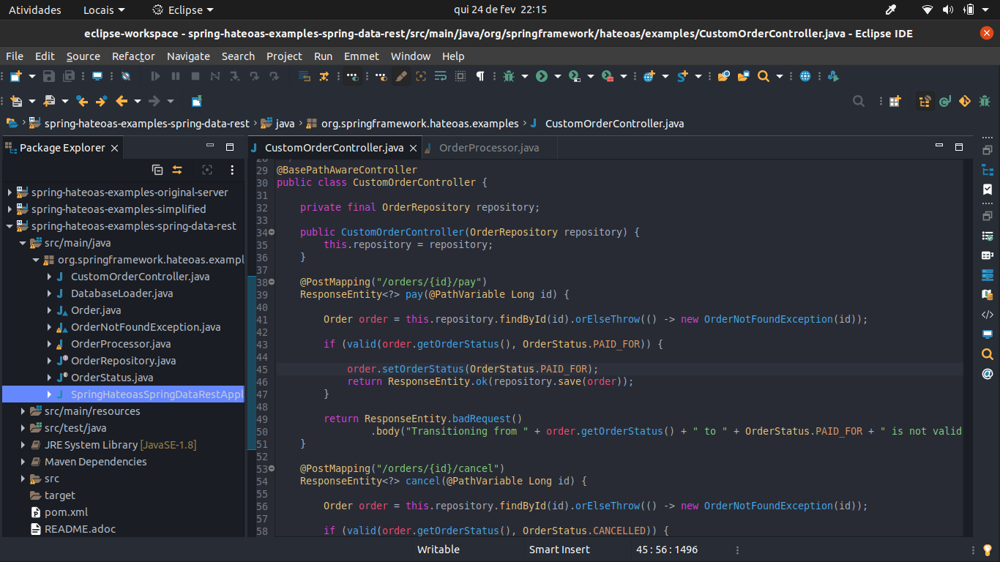
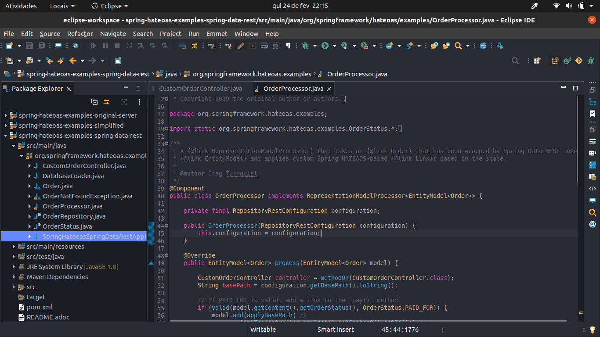
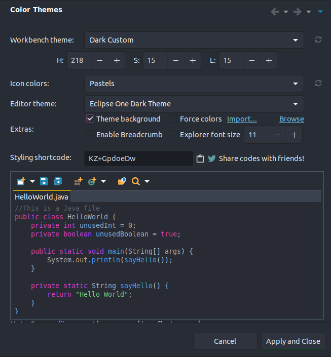

# [Eclipse](http://www.eclipse.org/) One Dark Theme

> [Atom](https://atom.io/) [One Dark](https://atom.io/themes/one-dark-ui/) inspired theme for [Eclipse](http://www.eclipse.org/)

## Install

Clone the repo or download using the GitHub.zip download option and unzip them.

## Prerequisites

[Eclipse IDE](http://www.eclipse.org/)
[Darkest Dark](https://marketplace.eclipse.org/content/darkest-dark-theme-devstyle) plugin

## Activating

- In Eclipse go to Window > Preferences > DevStyle > Color Theme.
- In Extras section, click import and select the downloaded eclipse-one-dark-theme.xml.
- Select Dark Custom from the Workbench Theme dropdown.
- Check Theme background in Extras section.
- Enter the HSL values of HSL(218, 15, 15).
- Apply the changes.
- Restart Eclipse.

Configuration screenshot:

## License

[MIT License](./LICENSE)
